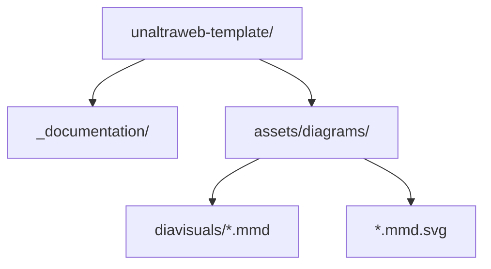
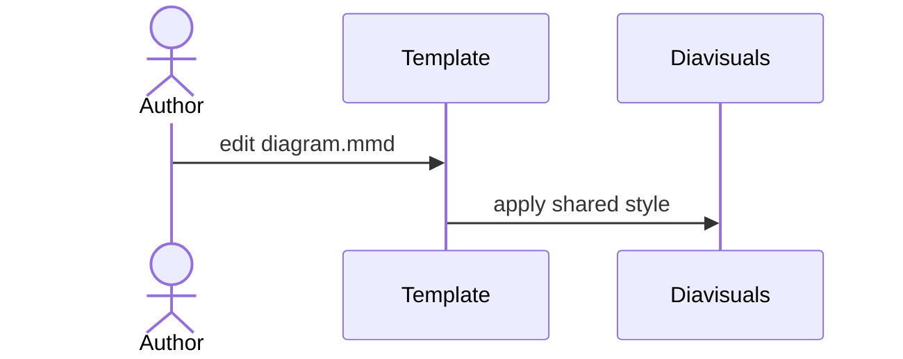
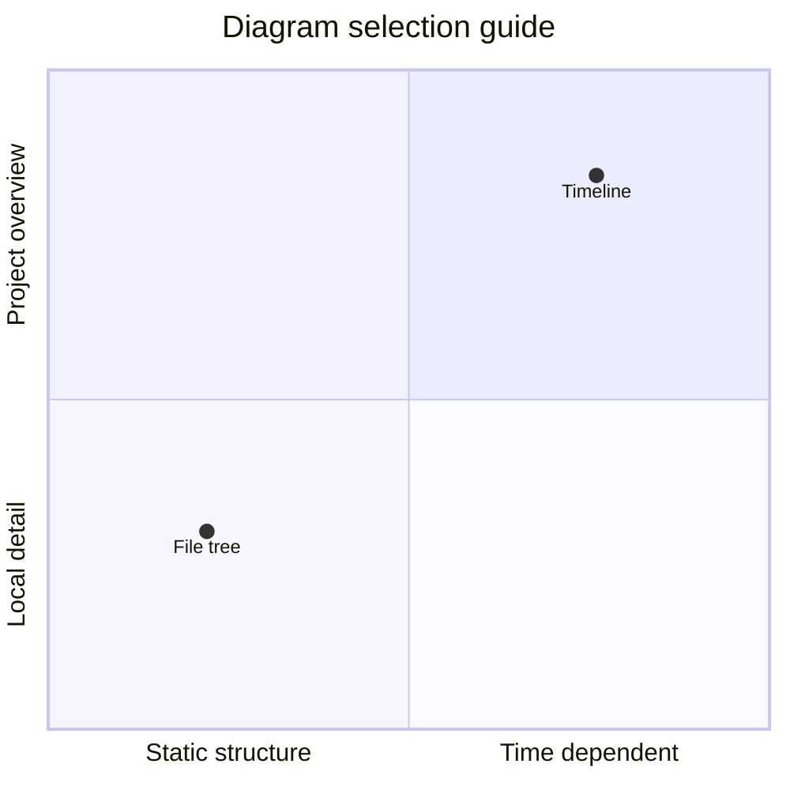

Els manuals combinen text, placeholders neutres i diagrames que expliquen estructura, seqüència o planificació.

>>> Els exemples resolts han de quedar ben separats del fil principal.

## Peus de figura

El plugin de figures embolcalla les imatges Markdown en un element `figure` semàntic i afegeix etiquetes localitzades. El títol de la imatge es converteix en el peu.

```markdown

```


## Composicions amb subfigures

Fes servir un bloc compacte tipus patchwork quan diverses imatges Markdown han de llegir-se com una sola figura. `a+b+c` posa panells en una sola fila, `/` obri una fila nova i atributs com `width` o `height` ajusten un panell concret.

```markdown
::: subfigures a+b+c "Tres panells verticals en una fila"
{: width="72%" }
{: width="72%" }
{: width="72%" }
:::
```

::: subfigures a+b+c "Tres placeholders verticals juxtaposats amb `a+b+c`"
{: width="72%" }
{: width="72%" }
{: width="72%" }
:::

Els panells horitzontals sovint es llegeixen millor com a files separades, sobretot quan la columna de text és estreta.

```markdown
::: subfigures a/b "Dos panells horitzontals apilats"


:::
```

::: subfigures a/b "Dos placeholders horitzontals apilats amb `a/b`"


:::

## Fonts Mermaid

La reescriptura `.mmd` manté fonts Mermaid llegibles al repositori i permet servir SVG. Els SVG es renderitzen amb l'estil compartit de `diavisuals` executant `make diagrams DIAVISUALS_DIR=../diavisuals`.

```markdown

```


### Diagrames D'Estructura

Usa diagrames de flux per a pipelines de construcció, decisions o estructura de repositori. Un arbre de fitxers és simplement un flux de dalt a baix amb carpetes i fitxers com a nodes.

````markdown

````

::: subfigures a/b "Diagrames d'estructura horitzontals apilats amb `a/b`"


:::

### Interacció I Temps

Usa un diagrama de seqüència quan la pregunta important és qui parla amb qui. Usa Gantt o una línia de temps quan la pregunta important és quan passa cada cosa.

````markdown

````


::: subfigures a/b "Diagrames temporals apilats amb `a/b`"


:::

### Models I Estat

Els diagrames de classes, entitat-relació i estats solen ser més alts que amples. Juxtaposar-los amb `a+b+c` conserva la comparació sense forçar una sola columna molt alta.

```markdown
::: subfigures a+b+c "Diagrames de model verticals"
{: width="82%" }
{: width="68%" }
{: width="78%" }
:::
```

::: subfigures a+b+c "Diagrames de model verticals juxtaposats amb `a+b+c`"
{: width="82%" }
{: width="68%" }
{: width="78%" }
:::

### Diagrames De Posicionament

Usa un quadrant quan l'objectiu és situar opcions o comparar prioritats, no mostrar valors numèrics precisos.

````markdown

````


### Diagrames Editables

Mantén el fitxer `.mmd` al costat de l'SVG generat. Si el professorat edita l'SVG, es pot guardar com `.mmd.edited.svg`.
