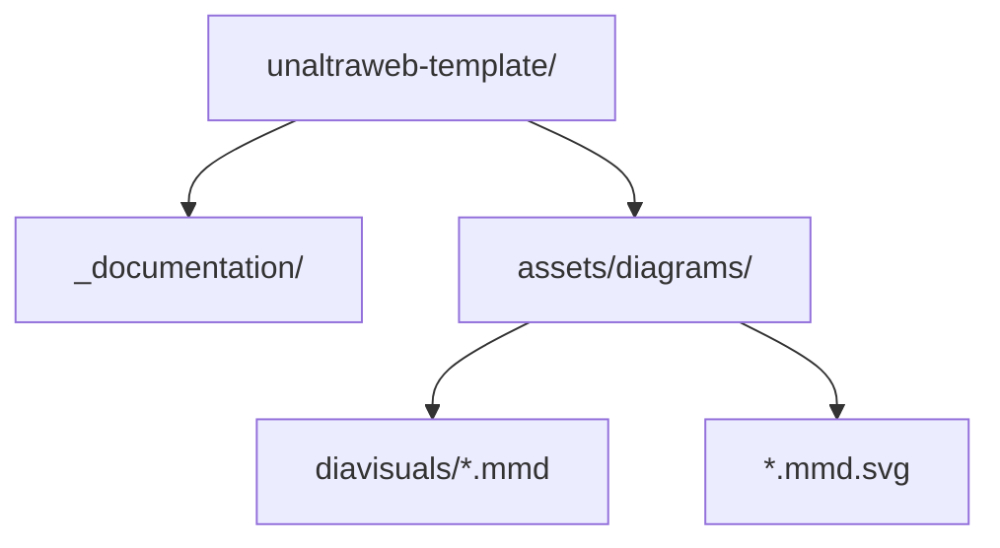
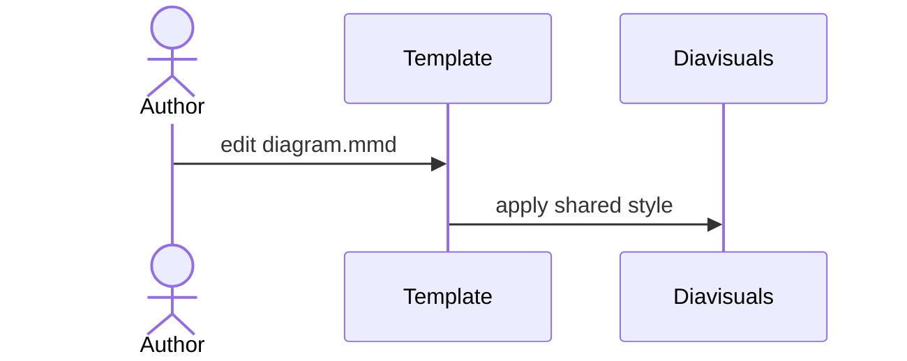
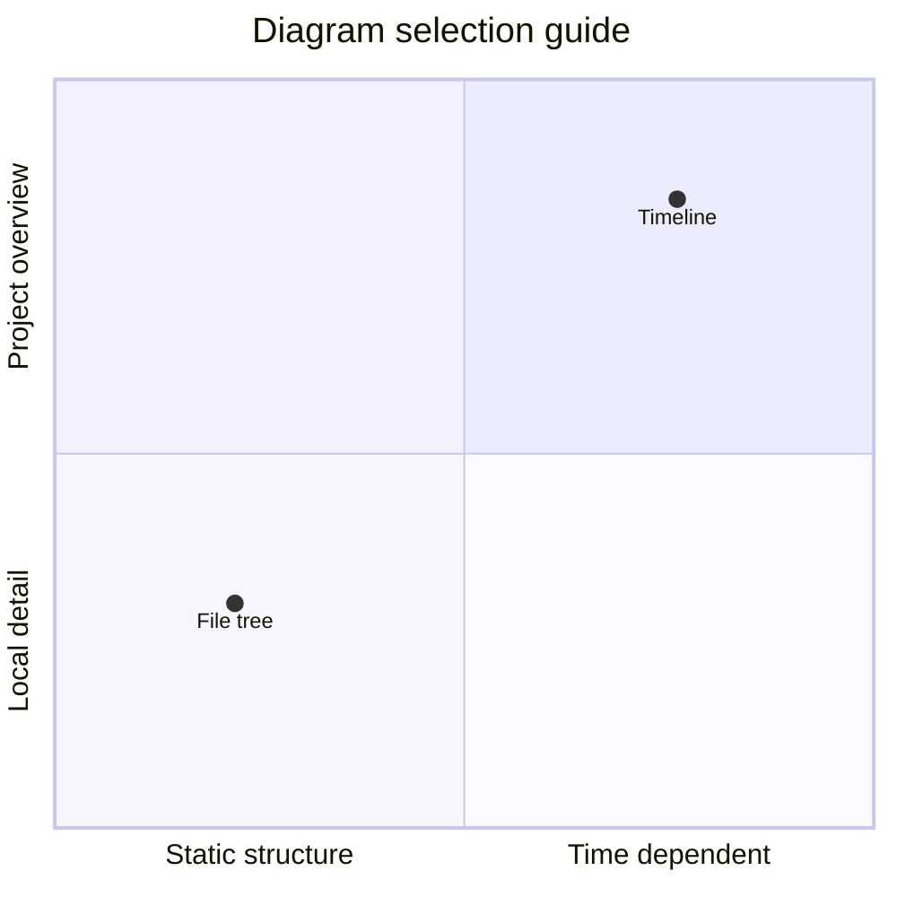

Manual chapters often mix prose, neutral placeholders and diagrams that explain structure, sequence or planning.

>>> Worked examples should stand apart from the main flow without becoming a decorative component.

## Figure captions

The figure plugin wraps Markdown images in a semantic `figure` element and adds localized labels. The image title becomes the caption.

```markdown

```


## Subfigure compositions

Use a compact patchwork-style block when several Markdown images need to read as one figure. `a+b+c` places panels in one row, `/` starts a new row, and image attributes such as `width` or `height` tune a specific panel.

```markdown
::: subfigures a+b+c "Three portrait panels in one row"
{: width="72%" }
{: width="72%" }
{: width="72%" }
:::
```

::: subfigures a+b+c "Three portrait placeholders juxtaposed with `a+b+c`"
{: width="72%" }
{: width="72%" }
{: width="72%" }
:::

Landscape panels often read better as separate rows, especially when the page column is narrow.

```markdown
::: subfigures a/b "Two landscape panels stacked as rows"


:::
```

::: subfigures a/b "Two landscape placeholders stacked with `a/b`"


:::

## Mermaid sources

The `.mmd` rewrite keeps Mermaid sources readable in the repository while allowing the site to serve SVG output. The SVGs are rendered with the shared `diavisuals` style by running `make diagrams DIAVISUALS_DIR=../diavisuals`.

```markdown

```


### Structure Diagrams

Use flowcharts for build pipelines, decisions or repository structure. A file tree is just a top-down flowchart with folders and files as nodes.

````markdown

````

::: subfigures a/b "Landscape structure diagrams stacked with `a/b`"


:::

### Interaction And Time

Use a sequence diagram when the important question is who talks to whom. Use a Gantt chart or timeline when the important question is when something happens.

````markdown

````


::: subfigures a/b "Time-oriented diagrams stacked with `a/b`"


:::

### Models And State

Class, entity-relationship and state diagrams are usually taller than they are wide. Juxtaposing them with `a+b+c` keeps the comparison visible without forcing a single tall column.

```markdown
::: subfigures a+b+c "Vertical model diagrams"
{: width="82%" }
{: width="68%" }
{: width="78%" }
:::
```

::: subfigures a+b+c "Vertical model diagrams juxtaposed with `a+b+c`"
{: width="82%" }
{: width="68%" }
{: width="78%" }
:::

### Positioning Diagrams

Use a quadrant chart when the goal is to position options or compare priorities, not to show precise numeric values.

````markdown

````


### Editable diagram files

Keep the `.mmd` source next to the generated SVG. If a teacher edits the SVG by hand, save it as `.mmd.edited.svg` and it will be preferred.
