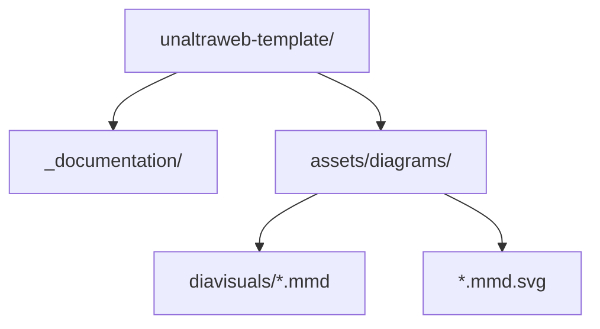
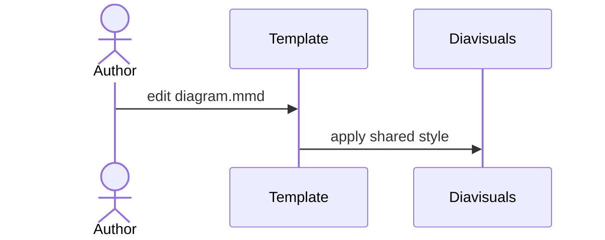
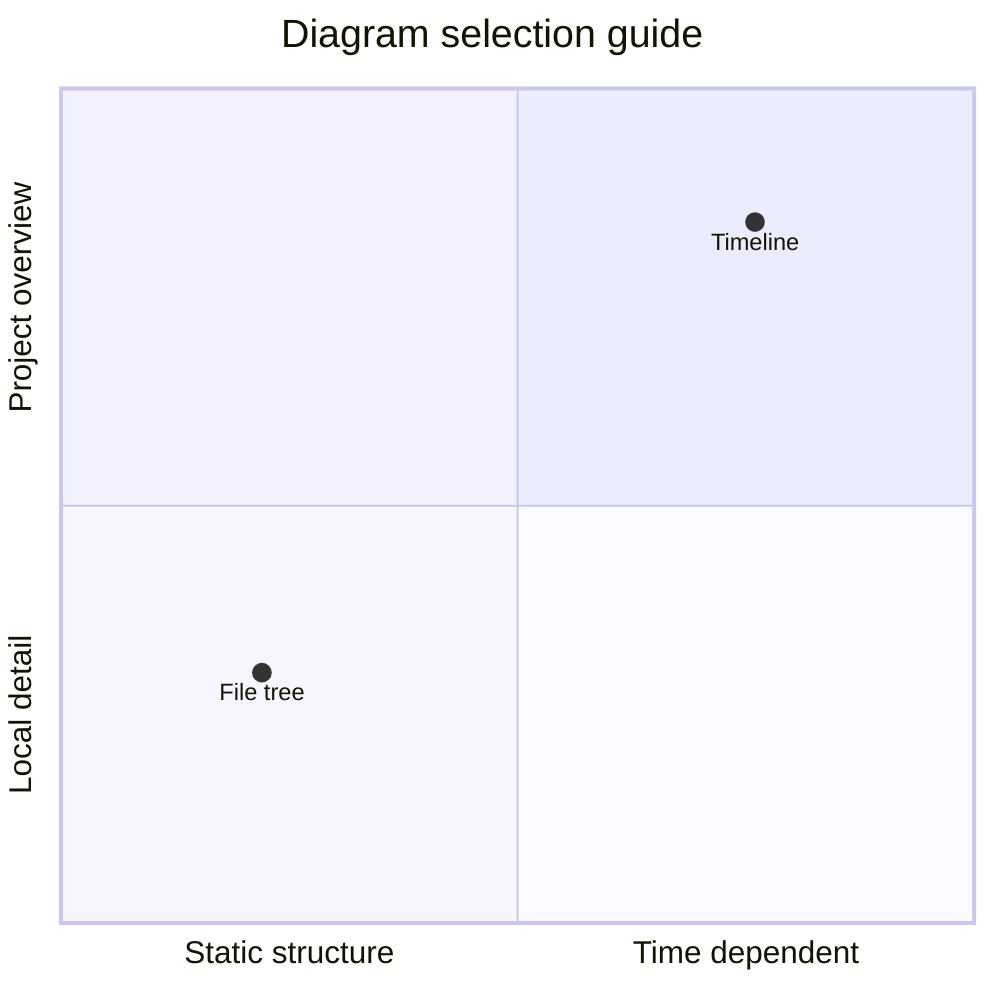

Los manuales combinan texto, placeholders neutros y diagramas que explican estructura, secuencia o planificación.

>>> Los ejemplos resueltos deben quedar bien separados del hilo principal.

## Pies de figura

El plugin de figuras envuelve las imágenes Markdown en un elemento `figure` semántico y añade etiquetas localizadas. El título de la imagen se convierte en el pie.

```markdown

```


## Composiciones con subfiguras

Usa un bloque compacto tipo patchwork cuando varias imágenes Markdown deben leerse como una sola figura. `a+b+c` coloca paneles en una sola fila, `/` abre una fila nueva y atributos como `width` o `height` ajustan un panel concreto.

```markdown
::: subfigures a+b+c "Tres paneles verticales en una fila"
{: width="72%" }
{: width="72%" }
{: width="72%" }
:::
```

::: subfigures a+b+c "Tres placeholders verticales yuxtapuestos con `a+b+c`"
{: width="72%" }
{: width="72%" }
{: width="72%" }
:::

Los paneles horizontales suelen leerse mejor como filas separadas, sobre todo cuando la columna de texto es estrecha.

```markdown
::: subfigures a/b "Dos paneles horizontales apilados"


:::
```

::: subfigures a/b "Dos placeholders horizontales apilados con `a/b`"


:::

## Fuentes Mermaid

La reescritura `.mmd` mantiene fuentes Mermaid legibles en el repositorio y permite servir SVG. Los SVG se renderizan con el estilo compartido de `diavisuals` ejecutando `make diagrams DIAVISUALS_DIR=../diavisuals`.

```markdown

```


### Diagramas De Estructura

Usa diagramas de flujo para pipelines de construcción, decisiones o estructura de repositorio. Un árbol de archivos es simplemente un flujo de arriba abajo con carpetas y archivos como nodos.

````markdown

````

::: subfigures a/b "Diagramas de estructura horizontales apilados con `a/b`"


:::

### Interacción Y Tiempo

Usa un diagrama de secuencia cuando la pregunta importante es quién habla con quién. Usa Gantt o una línea de tiempo cuando la pregunta importante es cuándo pasa cada cosa.

````markdown

````


::: subfigures a/b "Diagramas temporales apilados con `a/b`"


:::

### Modelos Y Estado

Los diagramas de clases, entidad-relación y estados suelen ser más altos que anchos. Yuxtaponerlos con `a+b+c` conserva la comparación sin forzar una sola columna muy alta.

```markdown
::: subfigures a+b+c "Diagramas de modelo verticales"
{: width="82%" }
{: width="68%" }
{: width="78%" }
:::
```

::: subfigures a+b+c "Diagramas de modelo verticales yuxtapuestos con `a+b+c`"
{: width="82%" }
{: width="68%" }
{: width="78%" }
:::

### Diagramas De Posicionamiento

Usa un cuadrante cuando el objetivo es situar opciones o comparar prioridades, no mostrar valores numéricos precisos.

````markdown

````


### Diagramas Editables

Mantén el archivo `.mmd` junto al SVG generado. Si el profesorado edita el SVG, se puede guardar como `.mmd.edited.svg`.
