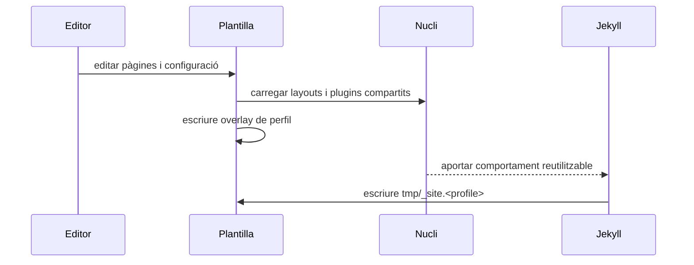

Els diagrames Mermaid funcionen dins de les pàgines de documentació, de manera que els fluxos tècnics poden viure al costat del text.

```mermaid
sequenceDiagram
  participant Editor
  participant Plantilla
  participant Nucli
  participant Jekyll
  Editor->>Plantilla: editar pàgines i configuració
  Plantilla->>Nucli: carregar layouts i plugins compartits
  Plantilla->>Plantilla: escriure overlay de perfil
  Nucli-->>Jekyll: aportar comportament reutilitzable
  Jekyll->>Plantilla: escriure tmp/_site.<profile>
```
