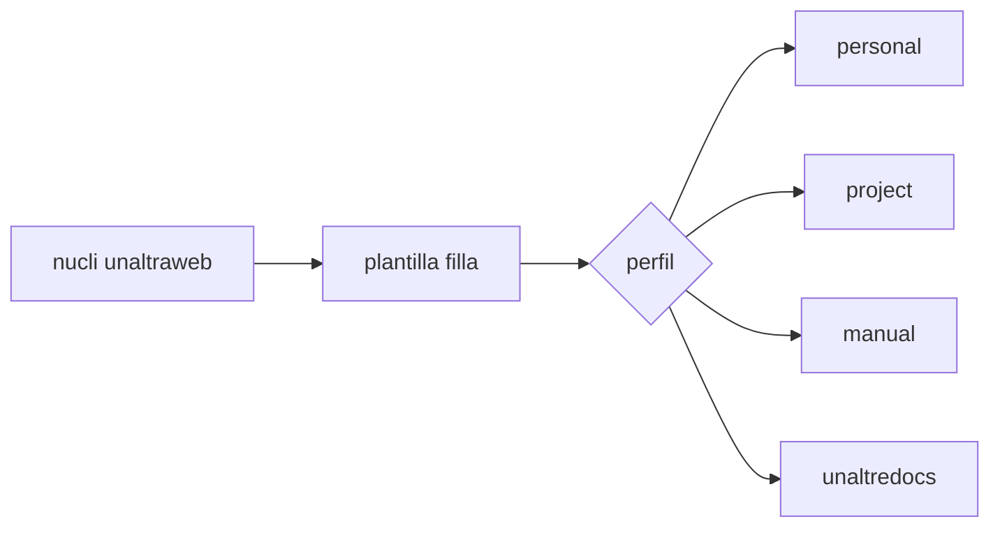

Les pàgines de documentació poden barrejar text, diagrames, figures indexades i captures. Això serveix per a documentació de paquets, diccionaris de dades, fluxos de treball i notes de versió.

Usa peus de figura quan una captura o diagrama forma part de l'argument. Deixa les imatges decoratives per al hero o el disseny de targetes.
