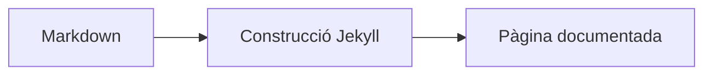

`unaltraweb` manté l'autoria prop del Markdown ordinari. La sintaxi addicional és petita a propòsit: qui escriu conserva un text llegible i el nucli converteix patrons acadèmics repetits en HTML estructurat.

## Drecera per a avisos

Les cites Markdown imbricades es converteixen en avisos docents. Un sol `>` continua sent una cita normal; els nivells més profunds seleccionen el tipus d'avís.

```markdown
>> Una nota o consell.

>>> Un exemple resolt.

>>>> Una advertència.

>>>>> Objectius d'aprenentatge.

>>>>>> Una nota de precaució o perill.
```

>> Una nota o consell.

>>> Un exemple resolt.

>>>> Una advertència.

>>>>> Objectius d'aprenentatge.

>>>>>> Una nota de precaució o perill.

Les etiquetes ixen de `_data/i18n/*.yml`, així que el mateix Markdown es renderitza com `NOTE`, `NOTA`, `OBJECTIUS D'APRENENTATGE`, etc. segons la llengua de la pàgina.

## Figures numerades

Les imatges Markdown en les col·leccions configurades es converteixen en figures semàntiques amb numeració localitzada. El títol de la imatge passa a ser el peu; si no hi ha títol, es reutilitza el text alternatiu.

```markdown

```


## Taules numerades

Usa un bloc `table` quan una taula Markdown necessite peu i comptador propi.

```markdown
::: table "Resum de dreceres"
| Sintaxi | Renderitzador | Resultat |
| --- | --- | --- |
| `>>` | `callouts.js` | Avís amb tema |
| `::: table` | `figure_captions.rb` | Taula numerada |
:::
```

::: table "Resum de dreceres"
| Sintaxi | Renderitzador | Resultat |
| --- | --- | --- |
| `>>` | `callouts.js` | Avís amb tema |
| `::: table` | `figure_captions.rb` | Taula numerada |
:::

## Composicions amb subfigures

Les subfigures usen un bloc compacte. La cadena de composició pot usar files compactes com `abc`, `/` per a files i `+` quan els separadors explícits fan més clara la composició.

```markdown
::: subfigures abc "Tres panells en una sola fila"


:::
```

::: subfigures abc "Tres panells en una sola fila"


:::

::: subfigures a+b/c "Composició de dues files amb separadors explícits"


:::

## Blocs Mermaid

Les pàgines amb `mermaid.enabled: true` poden mantindre diagrames en blocs de codi.

````markdown

````


## Fonts Mermaid com a figures SVG

Quan una imatge apunta a una font `.mmd`, el nucli la reescriu a `.mmd.edited.svg` si aquest fitxer existeix; si no, usa `.mmd.svg`. Així es conserva la font Mermaid llegible i se serveix l'SVG generat o editat a mà.

```markdown

```


## Per què és deliberat

Aquestes dreceres són creatives però conservadores. Eviten components grans a mida, mantenen llegibles els fitxers font i fan repetibles patrons acadèmics en llocs personals, llocs de projecte, manuals i documentació tècnica.
