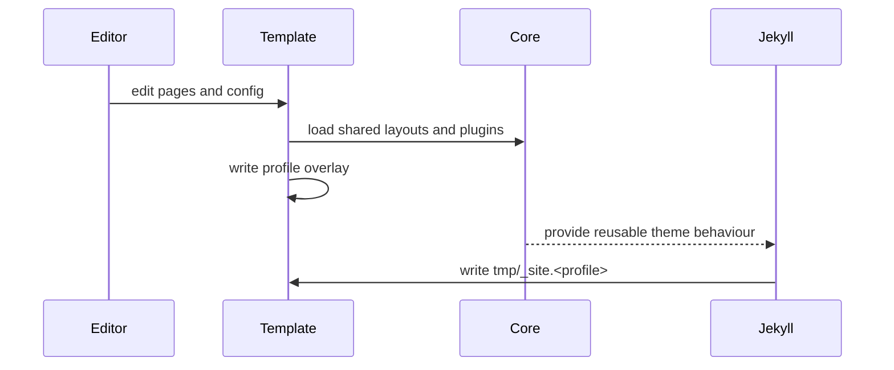

Mermaid diagrams work inside documentation pages, so technical workflows can stay close to the text.

```mermaid
sequenceDiagram
  participant Editor
  participant Template
  participant Core
  participant Jekyll
  Editor->>Template: edit pages and config
  Template->>Core: load shared layouts and plugins
  Template->>Template: write profile overlay
  Core-->>Jekyll: provide reusable theme behaviour
  Jekyll->>Template: write tmp/_site.<profile>
```
