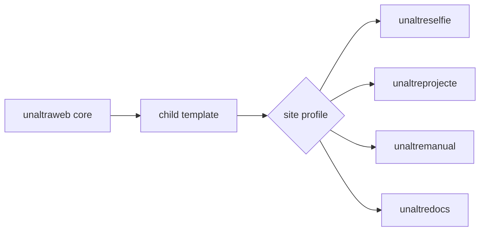

Documentation pages can mix narrative text, diagrams, indexed figures and screenshots. This is useful for package docs, data dictionaries, workflow explanations and release notes.

Use figure captions when a screenshot or diagram is part of the argument. Keep decorative images in the hero or card design instead.
