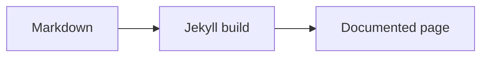
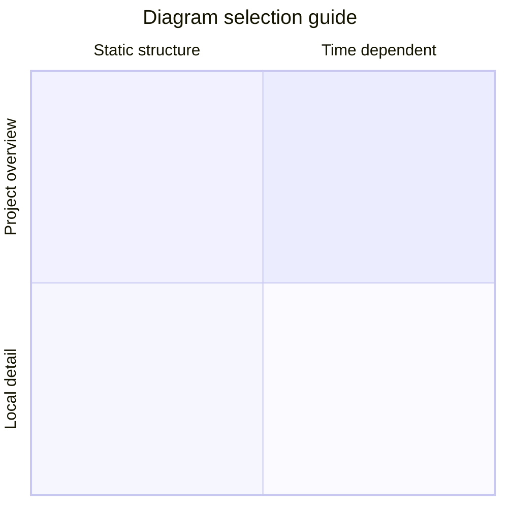

`unaltraweb` keeps authoring close to ordinary Markdown. The extra syntax below is intentionally small: authors write readable text, and the core turns repeated academic patterns into structured HTML.

## Callout shorthand

Nested blockquotes become teaching callouts. A single `>` remains a normal quotation; deeper levels select the callout type.

```markdown
>> A note or tip.

>>> A worked example.

>>>> A warning.

>>>>> Learning objectives.

>>>>>> A caution or danger note.
```

>> A note or tip.

>>> A worked example.

>>>> A warning.

>>>>> Learning objectives.

>>>>>> A caution or danger note.

The labels come from `_data/i18n/*.yml`, so the same Markdown renders as `NOTE`, `NOTA`, `OBJECTIUS D'APRENENTATGE`, and so on depending on the page language.

## Numbered figures

Markdown images in configured collections become semantic figures with localized numbering. The image title becomes the caption; if no title exists, the alt text is reused.

```markdown

```


## Numbered tables

Use a `table` block when a Markdown table needs a caption and its own counter.

```markdown
::: table "Shortcut summary"
| Syntax | Renderer | Result |
| --- | --- | --- |
| `>>` | `callouts.js` | Themed callout |
| `::: table` | `figure_captions.rb` | Numbered table |
:::
```

::: table "Shortcut summary"
| Syntax | Renderer | Result |
| --- | --- | --- |
| `>>` | `callouts.js` | Themed callout |
| `::: table` | `figure_captions.rb` | Numbered table |
:::

## Subfigure compositions

Subfigures use one compact block. The layout string can use compact row labels such as `abc`, `/` for rows, and `+` when explicit panel separators are clearer. Image attributes such as `{: width="70%" }` or `{: height="12rem" }` also work inside subfigures; they size that panel instead of forcing every item in a row to the same visual weight.

```markdown
::: subfigures a+b+c "Three portrait panels in one row"
{: width="72%" }
{: width="72%" }
{: width="72%" }
:::
```

::: subfigures a+b+c "Three portrait panels in one row"
{: width="72%" }
{: width="72%" }
{: width="72%" }
:::

::: subfigures a/b "Two landscape panels stacked as rows"


:::

## Mermaid fences

Pages that set `mermaid.enabled: true` can keep quick sketches inline as fenced code blocks. Use `.mmd` sources for reproducible figures rendered with `diavisuals`.

````markdown

````


## Mermaid source files as SVG figures

When an image points to a `.mmd` source, the core rewrites it to `.mmd.edited.svg` if that file exists, otherwise to `.mmd.svg`. Authors can keep the Mermaid source readable while serving the generated or hand-edited SVG. Run `make diagrams DIAVISUALS_DIR=../diavisuals` to render these examples with the shared style package.

```markdown

```


Use `a/b` when landscape diagrams need the full text column.

```markdown
::: subfigures a/b "Structure diagrams"


:::
```

::: subfigures a/b "Structure diagrams rendered with the shared `diavisuals` style"


:::

Use `a+b+c` when vertical diagrams should be compared side by side.

::: subfigures a+b+c "Vertical model diagrams rendered with the shared `diavisuals` style"
{: width="82%" }
{: width="68%" }
{: width="78%" }
:::

Use standalone figures when the diagram is a full explanation rather than a panel in a comparison.

````markdown

````


## Why this is deliberate

These shortcuts are creative but conservative. They avoid large bespoke components, preserve readable source files and make academic patterns repeatable across personal sites, project sites, manuals and technical documentation.
