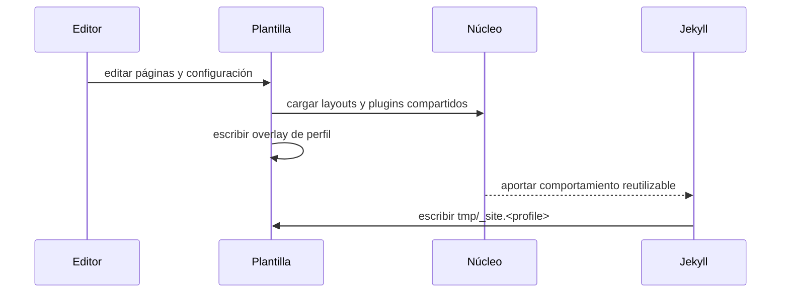

Los diagramas Mermaid funcionan dentro de las páginas de documentación, así que los flujos técnicos pueden vivir junto al texto.

```mermaid
sequenceDiagram
  participant Editor
  participant Plantilla
  participant Núcleo
  participant Jekyll
  Editor->>Plantilla: editar páginas y configuración
  Plantilla->>Núcleo: cargar layouts y plugins compartidos
  Plantilla->>Plantilla: escribir overlay de perfil
  Núcleo-->>Jekyll: aportar comportamiento reutilizable
  Jekyll->>Plantilla: escribir tmp/_site.<profile>
```
