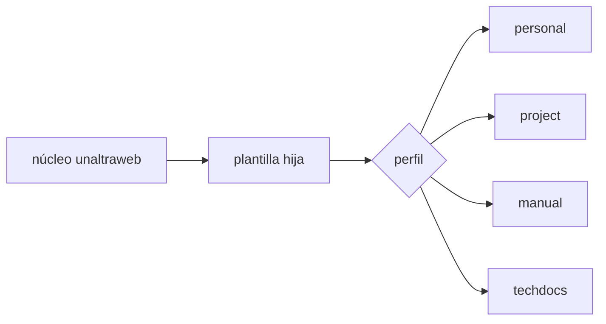

Las páginas de documentación pueden mezclar texto, diagramas, figuras indexadas y capturas. Esto sirve para documentación de paquetes, diccionarios de datos, flujos de trabajo y notas de versión.

Usa pies de figura cuando una captura o diagrama forma parte del argumento. Deja las imágenes decorativas para el hero o el diseño de tarjetas.
