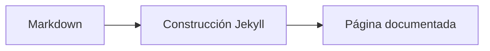

`unaltraweb` mantiene la autoría cerca del Markdown ordinario. La sintaxis adicional es pequeña a propósito: quien escribe conserva un texto legible y el núcleo convierte patrones académicos repetidos en HTML estructurado.

## Atajo para avisos

Las citas Markdown anidadas se convierten en avisos docentes. Un solo `>` sigue siendo una cita normal; los niveles más profundos seleccionan el tipo de aviso.

```markdown
>> Una nota o consejo.

>>> Un ejemplo resuelto.

>>>> Una advertencia.

>>>>> Objetivos de aprendizaje.

>>>>>> Una nota de precaución o peligro.
```

>> Una nota o consejo.

>>> Un ejemplo resuelto.

>>>> Una advertencia.

>>>>> Objetivos de aprendizaje.

>>>>>> Una nota de precaución o peligro.

Las etiquetas salen de `_data/i18n/*.yml`, así que el mismo Markdown se renderiza como `NOTE`, `NOTA`, `OBJECTIUS D'APRENENTATGE`, etc. según la lengua de la página.

## Figuras numeradas

Las imágenes Markdown en las colecciones configuradas se convierten en figuras semánticas con numeración localizada. El título de la imagen pasa a ser el pie; si no hay título, se reutiliza el texto alternativo.

```markdown

```


## Tablas numeradas

Usa un bloque `table` cuando una tabla Markdown necesite pie y contador propio.

```markdown
::: table "Resumen de atajos"
| Sintaxis | Renderizador | Resultado |
| --- | --- | --- |
| `>>` | `callouts.js` | Aviso con tema |
| `::: table` | `figure_captions.rb` | Tabla numerada |
:::
```

::: table "Resumen de atajos"
| Sintaxis | Renderizador | Resultado |
| --- | --- | --- |
| `>>` | `callouts.js` | Aviso con tema |
| `::: table` | `figure_captions.rb` | Tabla numerada |
:::

## Composiciones con subfiguras

Las subfiguras usan un bloque compacto. La cadena de composición puede usar filas compactas como `abc`, `/` para filas y `+` cuando los separadores explícitos hacen más clara la composición.

```markdown
::: subfigures abc "Tres paneles en una sola fila"


:::
```

::: subfigures abc "Tres paneles en una sola fila"


:::

::: subfigures a+b/c "Composición de dos filas con separadores explícitos"


:::

## Bloques Mermaid

Las páginas con `mermaid.enabled: true` pueden mantener diagramas en bloques de código.

````markdown

````


## Fuentes Mermaid como figuras SVG

Cuando una imagen apunta a una fuente `.mmd`, el núcleo la reescribe a `.mmd.edited.svg` si ese archivo existe; si no, usa `.mmd.svg`. Así se conserva la fuente Mermaid legible y se sirve el SVG generado o editado a mano.

```markdown

```


## Por qué es deliberado

Estos atajos son creativos pero conservadores. Evitan componentes grandes a medida, mantienen legibles los archivos fuente y hacen repetibles patrones académicos en sitios personales, sitios de proyecto, manuales y documentación técnica.
