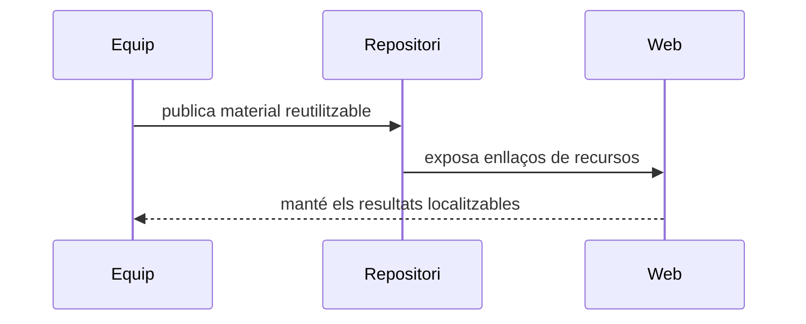

Aquesta pàgina agrupa els materials reutilitzables que un lloc de projecte sol necessitar quan la narrativa principal ja està definida.

::: subfigures ab/cd "Un exemple de subfigures en dues files per a recursos de projecte"

:::

| Recurs | Per a què serveix |
|---|---|
| [Resultats]({{ '/ca/resultats/' | relative_url }}) | Dades, mapes, informes, programari i productes de recerca reutilitzables. |
| [Repositoris]({{ '/ca/repositoris/' | relative_url }}) | Organitzacions de GitHub, repositoris de codi i enllaços d'infraestructura. |
| [Lectures]({{ '/ca/lectures/' | relative_url }}) | Llibres anotats, manuals i notes internes de lectura. |
