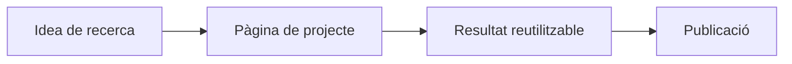

Usa `_projects/` per a projectes de recerca, programari, datasets, laboratoris o iniciatives de llarg recorregut.

::: subfigures abc "Un exemple de subfigures en una sola fila per a una pàgina personal de recerca"

:::


