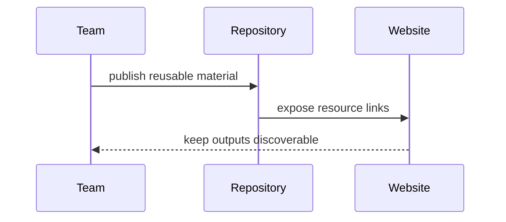

This landing page groups the reusable material that a project site usually needs after the main narrative is in place.

::: subfigures ab/cd "A two-row subfigure example for project resources"

:::

| Resource | Use it for |
|---|---|
| [Outputs]({{ '/en/outputs/' | relative_url }}) | Datasets, maps, reports, software and reusable research products. |
| [Repositories]({{ '/en/repositories/' | relative_url }}) | GitHub organisations, code repositories and infrastructure links. |
| [Readings]({{ '/en/readings/' | relative_url }}) | Annotated books, manuals and internal reading notes. |
