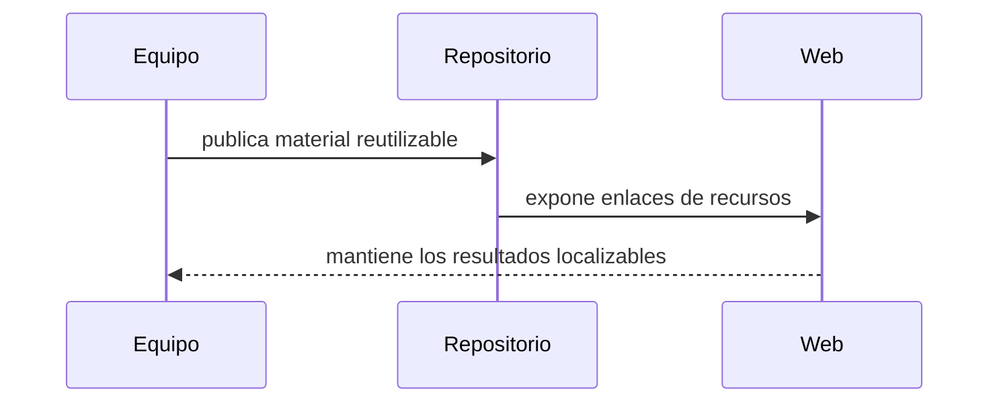

Esta página agrupa los materiales reutilizables que un sitio de proyecto suele necesitar cuando la narrativa principal ya está definida.

::: subfigures ab/cd "Un ejemplo de subfiguras en dos filas para recursos de proyecto"

:::

| Recurso | Para qué sirve |
|---|---|
| [Resultados]({{ '/es/resultados/' | relative_url }}) | Datos, mapas, informes, software y productos de investigación reutilizables. |
| [Repositorios]({{ '/es/repositorios/' | relative_url }}) | Organizaciones de GitHub, repositorios de código y enlaces de infraestructura. |
| [Lecturas]({{ '/es/lecturas/' | relative_url }}) | Libros anotados, manuales y notas internas de lectura. |
