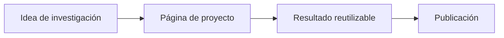

Usa `_projects/` para proyectos de investigación, software, datasets, laboratorios o iniciativas de largo recorrido.

::: subfigures abc "Un ejemplo de subfiguras en una sola fila para una página personal de investigación"

:::


